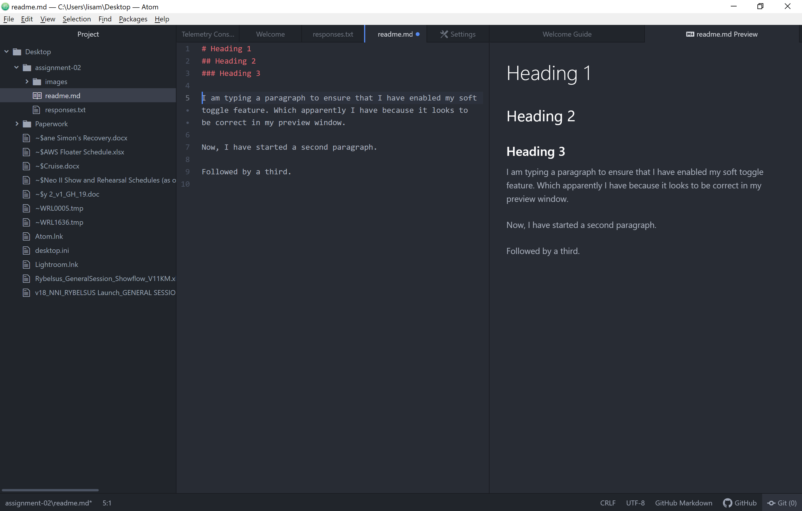

# Assignment 2
## Lisa Deer

The main reason I am taking this course is because it is a requirement to graduate. That being said, I do recognize the importance of having some basic knowledge of the internet and its protocols. The internet and web design is an imperative part of our society and it is very logical to have a basic understanding of how it works and how to navigate it.

Three things I have started to learn and I hope to master:
1. Basic web navigation.
2. How to make simple web edits.
3. How to write basic code.

[Course Website](https://intro-web-dev.media-ed-online.com/)

[My Responses](./responses.txt)

